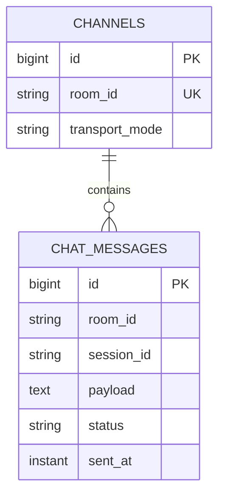
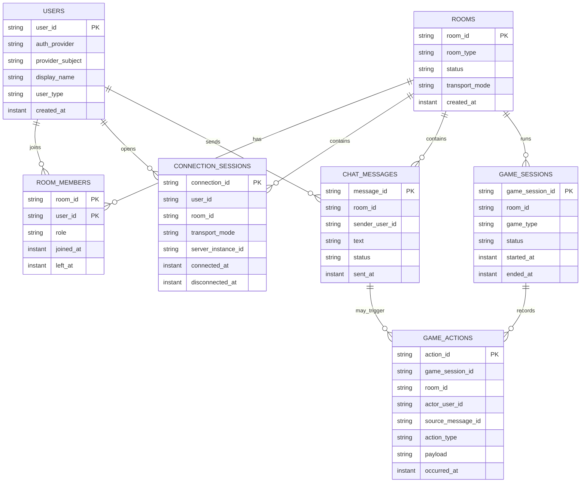

# Data Model

## 목적

채팅, 실시간 연결, 게임 이벤트를 안정적으로 확장하기 위한 데이터 모델 방향을 정리한다.

현재 구현은 `Channel`과 `ChatMessage` 중심의 MVP 모델이다. 다음 단계에서는 유저, 방 멤버십, 연결 세션, 메시지 ID를 명시해야 한다.

## 현재 모델



현재 한계:

- `sessionId`가 발신자 역할까지 겸한다.
- `messageId`가 외부 계약에 없다.
- room과 channel 개념이 섞여 있다.
- room membership이 없다.
- 여러 서버 인스턴스에서 connection registry를 공유하지 못한다.

## 목표 개념

### User

서비스 사용자를 의미한다.

초기에는 guest user를 허용한다. 로그인 도입 후에는 Cognito subject와 연결한다.

### Room

채팅 또는 게임이 일어나는 공간이다.

### RoomMember

user가 room에 어떤 권한으로 참여 중인지 나타낸다.

### ConnectionSession

WebSocket/TCP 연결 단위다. user와 다르다.

한 user가 여러 탭/기기에서 여러 connection을 가질 수 있다.

### Message

채팅 메시지다.

### RealtimeEvent

채팅 메시지, 입장/퇴장, 게임 액션 등 클라이언트로 broadcast 가능한 이벤트다.

### GameSession

room 안에서 진행되는 게임 인스턴스다.

### GameMission

유저 또는 팀에게 부여되는 미션이다.

### GameAction

유저가 채팅 입력, 버튼 클릭, 화면 상호작용 등으로 제출한 게임 입력이다.

## 목표 ERD



## 식별자

권장 value object:

```txt
UserId
RoomId
MessageId
ConnectionId
RequestId
EventId
```

현재 `RoomId`, `SessionId`가 있으나, `SessionId`는 장기적으로 `ConnectionId`에 가깝다.

## 저장소 방향

운영 저장소의 기본 방향은 DynamoDB다.

기존 JPA/Postgres 구현은 로컬 MVP와 빠른 검증을 위한 현재 구현으로 보고, 운영 구조는 DynamoDB access pattern을 기준으로 재설계한다.

DynamoDB에 특히 잘 맞는 데이터는 append-heavy, time-ordered access pattern이 명확한 데이터다.

```txt
ChatMessage
RealtimeEvent
Presence heartbeat
Game event log
```

채팅 기반 게임에서는 `ChatMessage`와 `GameAction`을 분리한다.

- 모든 유저 입력이 채팅 메시지는 아니다.
- 모든 채팅 메시지가 게임 액션은 아니다.
- 어떤 채팅 메시지는 게임 액션을 유발할 수 있다.
- `sourceMessageId`로 연결하면 나중에 “이 게임 이벤트가 어떤 채팅에서 나왔는지” 추적할 수 있다.

## DynamoDB room event stream 후보

테이블명:

```txt
wowtalk-room-events
```

키:

```txt
PK = ROOM#<roomId>
SK = EVT#<occurredAtEpochMillis>#<eventId>
```

채팅 메시지 아이템 예:

```json
{
  "pk": "ROOM#lobby",
  "sk": "EVT#1779540000000#evt-1",
  "eventId": "evt-1",
  "eventType": "CHAT_MESSAGE_CREATED",
  "messageId": "msg-1",
  "roomId": "lobby",
  "actorUserId": "guest-1",
  "payload": {
    "text": "안녕하세요"
  },
  "occurredAt": "2026-05-23T13:00:00Z"
}
```

지원 access pattern:

```txt
방의 최근 이벤트 N개 조회
방의 특정 시각 이후 이벤트 조회
방 입장 시 채팅/게임 이벤트 복원
```

메시지 단건 조회가 자주 필요하면 GSI를 추가한다.

```txt
GSI1PK = MESSAGE#<messageId>
GSI1SK = ROOM#<roomId>
```

게임은 순서가 중요하므로 timestamp만으로 충분한지, 별도 `sequence`를 둘지 검토한다.

아이템 예:

```json
{
  "pk": "ROOM#game-1",
  "sk": "EVT#1779540002000#evt-2",
  "eventId": "evt-1",
  "gameSessionId": "game-session-1",
  "eventType": "GAME_ACTION_ACCEPTED",
  "actorUserId": "guest-1",
  "sourceMessageId": "msg-1",
  "payload": {
    "actionType": "MISSION_TEXT_SUBMITTED",
    "missionId": "mission-1"
  },
  "occurredAt": "2026-05-23T13:00:02Z"
}
```

## DynamoDB main table 후보

유저, 방, 멤버십처럼 현재 상태 조회가 중요한 데이터는 별도 main table로 시작한다.

테이블명:

```txt
wowtalk-main
```

아이템 후보:

```txt
USER#<userId>
ROOM#<roomId>
ROOM#<roomId> / MEMBER#<userId>
GAME#<gameSessionId>
GAME#<gameSessionId> / PLAYER#<userId>
```

처음부터 single-table design을 강제하지 않는다. 다만 access pattern을 문서화하고 필요한 경우 GSI를 추가한다.

## 멀티 인스턴스 연결 모델

현재:

```txt
WebSocketSessionRegistry = JVM memory
```

한계:

```txt
API instance A에 붙은 유저와 instance B에 붙은 유저가 직접 broadcast를 공유하지 못함
```

확장 방향:

```txt
Client -> API instance A
API instance A -> local sessions
API instance A -> broker publish
API instance B -> broker subscribe
API instance B -> local sessions
```

broker 후보:

- Redis Pub/Sub
- DynamoDB Streams
- SNS/SQS
- 별도 realtime gateway

초기 구현 난이도는 Redis Pub/Sub이 가장 낮다.

## 구현 순서

1. `MessageId`, `UserId`, `ConnectionId` 도입
2. `ChatMessage`에 `messageId`, `senderUserId` 추가
3. DB entity와 API response에 `messageId`, `senderUserId` 추가
4. guest user 모델 추가
5. room/member 모델 추가
6. protocol envelope와 requestId/eventId 도입
7. room event stream DynamoDB 구현 실험
8. 멀티 인스턴스 broadcast 설계

## 당장 하지 않을 것

- 로그인 전체 구현
- 복잡한 권한/친구/DM 모델
- 게임 상태 저장소 확정
- single-table design 강제
- Raw TCP 프로토콜 최종 확정

이 항목들은 기본 채팅 모델과 프로토콜 v1이 안정된 뒤 결정한다.
